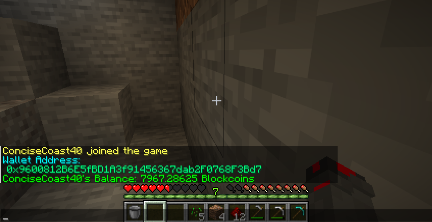
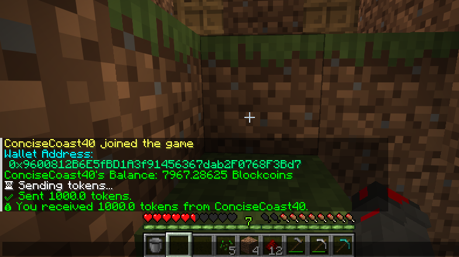
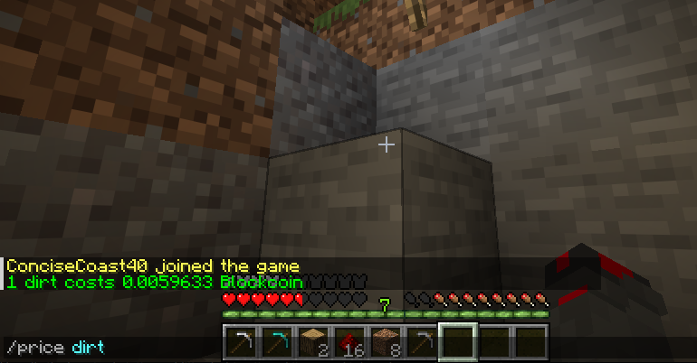
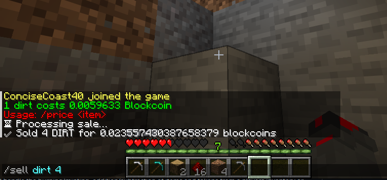
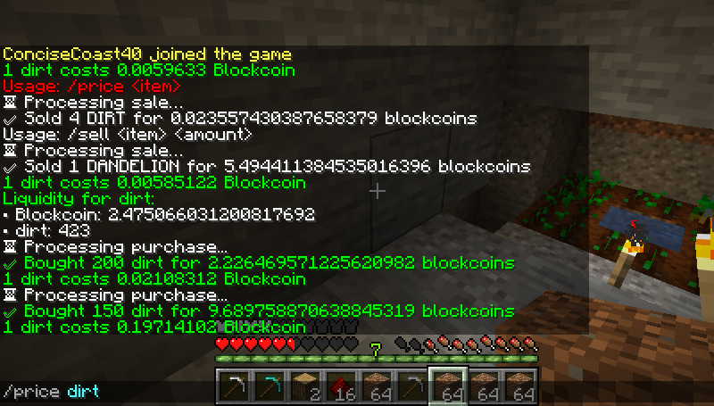
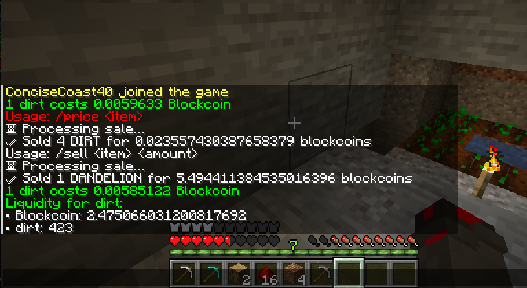
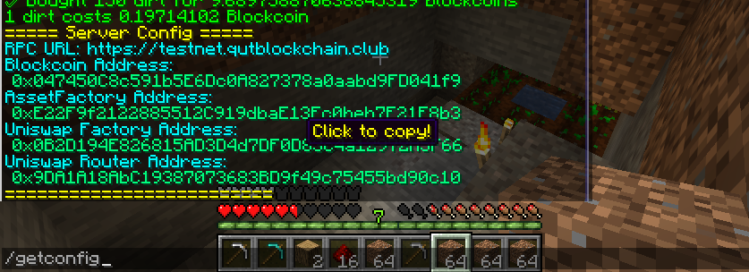
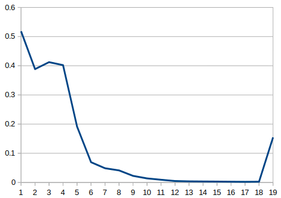

# crypto-craft


Buy, sell, exchange items and much more in Minecraft using blockchain technology!


This monorepo manages three key parts of cryptocraft:
1. : a foundry project managing the smart contracts required to mint and burn tokenized items, including deploying Uniswap V2
2. : a Minecraft server plugin written in Kotlin for translating user commands into blockchain transactions
3. : a dockerized Minecraft server which runs a server using the plugin jar file generated by server-plugin

# Developer Setup

Clone the repo
```bash
git clone https://github.com/csmit863/crypto-craft
```

Download foundry, maven, jq
```
curl -L https://foundry.paradigm.xyz | bash
foundryup
foundryup -i nightly

apt install maven
apt install jq
```

Configure a .env file:
```bash
PRIVATE_KEY=
RPC_URL=
```

Run the build script:
```bash
chmod +x build-project.sh
./build-project.sh
```
# How does it work?

## Smart Contracts
This project uses a model similar to how real-world-assets are minted and burned on the blockchain depending on real supply and exchange. However,
instead of the supply-controlling authority being a bank, exchange, company etc, it is the Minecraft server itself.
Every item in the game can be turned into a token - this is done through a factory architecture. A MinecraftAsset contract is defined which
has special functions for tokenizing and burning items, but otherwise just uses the ERC20 standard. The AssetFactory contract uses the MinecraftAsset
contract to deploy new minecraft items as tokens if they have not already been created yet. It also contains a list function allowing for the retrieval of all
created assets to ensure that there are no duplicate tokens.
Since the project is currently deployed on local testnets, Uniswap briefcase is employed in order to deploy and manage the V2 Factory and Router, and WETH contracts.


## Deployment
First, the Solidity smart contracts are built and deployed to the network of choosing (based on .env). 


Next, the smart contract addresses are logged and stored in a deployments.json file, and Uniswap deployments are recorded in a uniswap_deployments.json file.
These files are copied into the server-plugin project, and then compiled. 


The .jar file is then copied from server-plugin and pasted into the plugins folder in the docker-minecraft-server project. When the docker container starts,
it will start the minecraft server using the plugin jar file. 


## Commands/Gameplay

When users login to the game, they can view their Blockcoin balance by typing /bal. 


If they have Blockcoins, they can send them to other players by typing
/send (player name) (block coin amount). This will trigger a blockchain transaction to transfer coins from one account to the other. 


Since all items are V2 pairs on Uniswap (paired with Blockcoin) players can check the price of an item (once it has been initially sold) using /price (item)


Items can be sold with the /sell (item) command. This executes a swap between an item/blockcoin Uniswap pair, providing the player with blockcoins to buy other items, or to expand the world border.


A world border has been set to introduce scarcity to the item economy, however the world border can be expanded by any player using the /expand (blocks) command. As the world border increases by one block, each subsequent block of expansion becomes more expensive.


Pools have an initial liquidity injection of 1 item / 1000 blockcoins, to introduce blockcoins into circulation and to set the initial price. This gives players an incentive to be the first to find an item, be it dandelions, dirt, or diamonds. The initial price discovery phase is chaotic as there is very low liquidity. Until more liquidity is added by external liquidity providers, there may continue to be price instability. Alternatively, players sell items into the pool to increase the liquidity of an item, which brings the price down (often less than 1 blockcoin) but stabilises prices nevertheless. They can also amass a large amount of blockcoin by being the first to sell an item. 


To check the liquidity of a item/blockcoin pair, the /liquidity (item) command can be used. This can inform players before they buy/sell items, as low liquidity can mean high slippage and unexpected prices. 


Admins can retrieve the smart contract configuration using the /getconfig command. This returns the smart contract addresses in use. The smart contract addresses can also be changed by the operator with /set(config) command.


Because the data is on-chain, you can easily use an indexer to get the price history of a particular item if you have its pair address. Here is the price of dirt in blockcoin over a series of blocks:



Currently, player's wallets are managed insecurely and unencrypted via JSON file storage. In a more practical implementation of this concept, a developer may 
wish to instead create a client which players can run on their own device which manages keys and signs transactions. This would be used in tandem with server-side 
code that would handle the burning/minting, addition/subtraction of items and tokens from a players inventory or balance. 

Contributions and feedback are welcomed and encouraged!