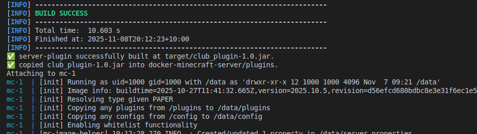
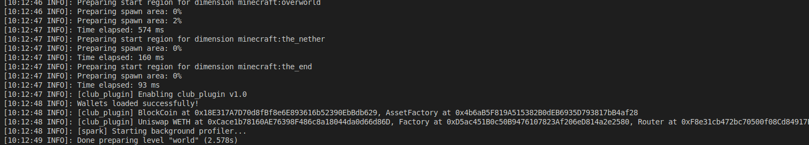
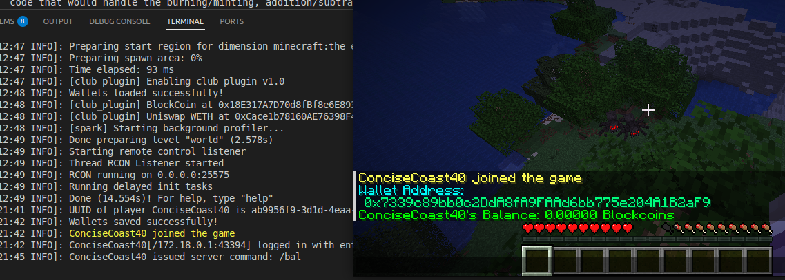

# crypto-craft


Buy, sell, exchange items and much more in Minecraft using blockchain technology!


This monorepo manages three key parts of cryptocraft:
1. : a foundry project managing the smart contracts required to mint and burn tokenized items, including deploying Uniswap V2
2. : a Minecraft server plugin written in Kotlin (similar to Java) for translating user commands into blockchain transactions
3. : a dockerized Minecraft server which runs a server using the plugin jar file generated by server-plugin

# Setup

Clone the repo
```bash
git clone https://github.com/csmit863/crypto-craft
```

Configure a .env file:
```bash
PRIVATE_KEY=
RPC_URL=
```

Run the build script:
```bash
chmod +x build-project.sh
./build-project.sh
```
# How does it work?


First, the Solidity smart contracts are built and deployed to the network of choosing (based on .env). 


Next, the smart contract addresses are logged and stored in a deployments.json file, and Uniswap deployments are recorded in a uniswap_deployments.json file.
These files are copied into the server-plugin project, and then compiled. 


The .jar file is then copied from server-plugin and pasted into the plugins folder in the docker-minecraft-server project. When the docker container starts,
it will start the minecraft server using the plugin jar file. 


When users login to the game, they can view their Blockcoin balance by typing /bal. 


If they have Blockcoins, they can send them to other players by typing
/send <player name> <block coin amount>. This will trigger a blockchain transaction to transfer coins from one account to the other. 


In this screenshot, the player's Blockcoin balance is 0. A transaction is signed to send 1 Blockcoin, but it fails due to insufficient funds. In the server logs, you 
can see the transaction hash and it's result.


Currently, player's wallets are managed insecurely and unencrypted via JSON file storage. In a more practical implementation of this concept, a developer may 
wish to instead create a client which players can run on their own device which manages keys and signs transactions. This would be used in tandem with server-side 
code that would handle the burning/minting, addition/subtraction of items and tokens from a players inventory or balance. 

Contributions and feedback are welcomed and encouraged!